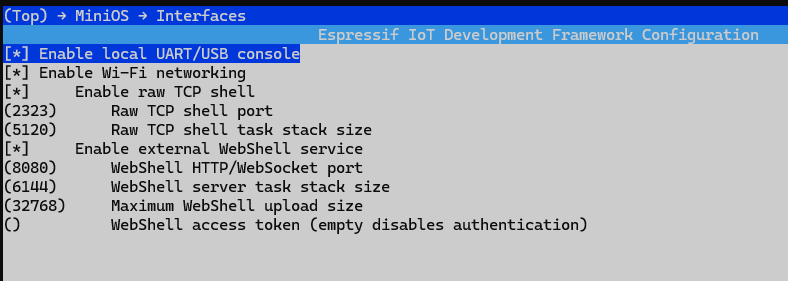

# MiniOS build and development guide

> [Português](#português) | [English](#english)

Este documento trata da compilação, configuração e extensão do firmware. Para
funcionalidades, comandos e exemplos de utilização do sistema operativo,
consulte o [guia do MiniOS](README.md).

## Português

### Requisitos

- ESP-IDF 5.5;
- toolchain RISC-V para ESP32-C3 fornecido pelo ESP-IDF;
- Python, CMake e Ninja instalados pelo ESP-IDF;
- uma placa ESP32-C3 e uma ligação UART/USB para gravação e diagnóstico.

### Compilar e gravar

Numa shell com o ambiente ESP-IDF carregado, execute na raiz do projeto:

```bash
idf.py set-target esp32c3
idf.py build
idf.py -p PORT flash monitor
```

Substitua `PORT` pela porta da placa. O firmware é gerado em
`build/minios.bin`. A configuração completa atualmente ocupa cerca de 989 KiB
e deixa 3% livres na partição de aplicação de 1 MiB.

Para abrir a configuração:

```bash
idf.py menuconfig
```

Todas as opções próprias do projeto estão agrupadas em:

```text
MiniOS
├── Interfaces
│   ├── local UART/USB console
│   ├── Wi-Fi networking
│   ├── raw TCP shell
│   └── external WebShell service
└── Components
    ├── example built-in applications
    │   ├── hello
    │   ├── counter
    │   └── welcome
    ├── external ELF application loader
    ├── built-in device modules
    └── example SSD1315 OLED module
```

As opções dependentes são ocultadas automaticamente. Por exemplo, desligar a
rede remove também as shells TCP/Web e os comandos `wifi`, `ifconfig` e
`ping`. Desligar uma aplicação interna retira o respetivo source e registo do
firmware.



### Perfis de build

O perfil sem rede utiliza `sdkconfig.no-network.defaults`:

```bash
idf.py -B build-no-network \
  -D "SDKCONFIG=build-no-network/sdkconfig" \
  -D "SDKCONFIG_DEFAULTS=sdkconfig.defaults;sdkconfig.no-network.defaults" \
  build
```

No ESP32-C3 medido, este perfil gera aproximadamente 333 KiB, contra 989 KiB
da configuração completa. `sdkconfig.defaults` contém defaults portáveis;
`sdkconfig` representa a configuração concreta atualmente selecionada.

### Arquitetura e componentes

```text
MiniOS Shell / applications
            ↓
        MiniOS API
            ↓
       MiniOS kernel
            ↓
 console · FS · HAL · network · modules
            ↓
      ESP-IDF / FreeRTOS
```

`main/main.c` apenas inicia o kernel. Cada subsistema vive num componente
ESP-IDF em `components/`:

| Componente | Responsabilidade |
| --- | --- |
| `minios_api` | API pública estável em `minios.h` |
| `minios_kernel` | Sequência de inicialização |
| `minios_console` | Transporte abstrato de entrada/saída |
| `minios_shell` | Parser, registry, scripts, editor e comandos |
| `minios_config` | Configuração persistente em NVS |
| `minios_fs` | LittleFS e namespaces protegidos |
| `minios_device` | Registry de dispositivos virtuais |
| `minios_hal` | GPIO, I²C e SPI |
| `minios_net` | Wi-Fi, IPv4, DNS e ping |
| `minios_remote` | Shell TCP |
| `minios_web` | API HTTP e shell WebSocket |
| `minios_module` | Módulos de dispositivos internos |
| `minios_app` | Aplicações internas e processos |
| `minios_elf` | Validação, relocation e execução ELF |

Um novo componente deve ter o seu próprio `CMakeLists.txt`, headers públicos
em `include/` e apenas as dependências necessárias:

```cmake
idf_component_register(
    SRCS "example.c"
    INCLUDE_DIRS "include"
    REQUIRES minios_api
)
```

Adicione opções do componente ao menu central em `main/Kconfig.projbuild`.
Use condições `CONFIG_MINIOS_*` no `CMakeLists.txt` para não compilar sources
desativados. Preserve o desacoplamento: headers públicos não devem expor tipos
internos do ESP-IDF ou FreeRTOS sem necessidade.

#### WebShell externo

A interface permanece no ficheiro único `tools/webshell/minios-webshell.html`.
O editor de texto usa `GET /api/fs/download` para abrir UTF-8 e
`PUT /api/fs/upload` para criar ou substituir o ficheiro. O firmware limita o
corpo através de `CONFIG_MINIOS_WEB_MAX_UPLOAD_SIZE`; as mesmas validações do
filesystem impedem escrita em `/dev` e `/modules`.

### Adicionar um comando

Crie um ficheiro em `components/minios_shell/commands/`. Um comando contém um
handler, metadados estáticos e uma função de registo:

```c
#include "shell_internal.h"

static int cmd_example(int argc, char **argv)
{
    (void)argv;
    if (argc != 1) {
        minios_shell_write("Usage: example\r\n");
        return -1;
    }
    minios_shell_write("Example\r\n");
    return 0;
}

static const minios_command_t example_command = {
    .name = "example",
    .description = "Run an example",
    .usage = "example",
    .handler = cmd_example,
};

int minios_cmd_example_register(void)
{
    return minios_shell_register(&example_command);
}
```

Depois:

1. declare a função em `components/minios_shell/shell_internal.h`;
2. acrescente o source a `components/minios_shell/CMakeLists.txt`;
3. invoque a função em `register_builtin_commands()` em `shell.c`;
4. se for opcional, proteja source e registo com a mesma opção Kconfig;
5. documente a sintaxe no [guia do MiniOS](README.md).

Handlers devolvem `0` em sucesso e um valor diferente de zero em erro. Devem
validar `argc`, comprimentos, ranges e estado dos subsistemas antes de atuar.

### Adicionar uma aplicação interna

As aplicações incluídas `hello`, `counter` e `welcome` são exemplos removíveis
que demonstram o Application Manager e a API pública; não são componentes
obrigatórios do sistema.

Uma aplicação usa apenas a API pública de `minios.h` e fornece um descriptor:

```c
#include "app_internal.h"

static int example_main(int argc, char **argv)
{
    (void)argc;
    (void)argv;
    os_print("Hello from example\r\n");
    return 0;
}

const os_app_descriptor_t *minios_app_example_descriptor(void)
{
    static const os_app_descriptor_t descriptor = {
        .name = "example",
        .description = "Example built-in application",
        .main = example_main,
    };
    return &descriptor;
}
```

Adicione o protótipo a `app_internal.h`, o registo a `os_app_init()` e o source
a `components/minios_app/CMakeLists.txt`. Para permitir seleção individual:

1. crie `CONFIG_MINIOS_ENABLE_APP_EXAMPLE` em `main/Kconfig.projbuild`;
2. condicione o source no CMake;
3. condicione o registo com `#if CONFIG_MINIOS_ENABLE_APP_EXAMPLE`.

Aplicações longas devem verificar periodicamente `os_app_should_stop()` para
que `kill` funcione de forma cooperativa. Não devem criar dependências diretas
em tipos do ESP-IDF na sua interface.

### Compilar uma aplicação ELF externa

O exemplo fornecido é compilado com:

```powershell
.\tools\elf\build-elf-app.ps1 `
    -Source .\tools\elf\examples\hello_elf.c `
    -Output .\hello_elf.elf
```

O segundo exemplo anima uma bola num OLED SSD1315 através da API pública do
Device Manager:

```powershell
.\tools\elf\build-elf-app.ps1 `
    -Source .\tools\elf\examples\ssd1315_ball.c `
    -Output .\ssd1315_ball.elf
```

Carregue o resultado para `/bin/ssd1315_ball.elf` pela WebShell. No MiniOS,
inicialize I²C, carregue o módulo `ssd1315` e execute o ELF. O exemplo usa
`frame-clear`, vários `pixel` e um único `refresh` por frame, e verifica
`os_app_should_stop()` para suportar `kill` cooperativo.

A aplicação deve exportar:

```c
#include "minios.h"

int minios_app_main(int argc, char **argv)
{
    os_print("Hello from ELF\r\n");
    return 0;
}
```

O formato suportado é ELF32 `ET_DYN`, RV32IMC, até 32 KiB, sem bibliotecas,
construtores ou TLS e com relocations RISC-V limitadas. Apenas símbolos
explicitamente exportados pela API MiniOS podem ser importados. O loader exige
SRAM gravável e executável; por isso `CONFIG_ESP_SYSTEM_MEMPROT_FEATURE` está
desativado. Código ELF é nativo e não tem sandbox.

### Adicionar um módulo interno

Um módulo de dispositivo fornece `minios_module_descriptor_t` com callbacks de
load/unload. O load deve reservar recursos, inicializar hardware e registar os
dispositivos; o unload deve recusar a operação quando estiver ocupado e desfazer
tudo por ordem inversa.

O `ssd1315` incluído é apenas um módulo de exemplo e referência para novos
drivers; pode ser retirado da imagem através do `menuconfig`.

Adicione o descriptor a `module_internal.h`, registe-o em
`minios_module_init()`, inclua o source no CMake e crie uma opção Kconfig se o
driver for opcional. A implementação de referência está em
`components/minios_module/modules/module_ssd1315.c`.

O loader ELF atual é uma ABI de aplicações, não de drivers persistentes.
Módulos ELF futuros precisam de entry points de load/unload, ownership de
recursos, registo controlado de dispositivos e bloqueio de unload em uso.

### Adicionar uma interface de shell

Implemente `minios_console_t` com callbacks `read`, `write`, `close` e um
contexto próprio. Execute `minios_shell_run_console()` numa task dedicada. Os
comandos são serializados pelo mutex da shell, permitindo reutilizar o mesmo
registry em UART, TCP e WebSocket.

Uma interface opcional deve ter:

- opção em `MiniOS -> Interfaces`;
- source real e stub ou exclusão condicional no CMake;
- limites explícitos de stack, sessões e buffers;
- autenticação e transporte documentados;
- nenhuma alteração direta ao parser ou aos handlers dos comandos.

### Verificações antes de entregar

```bash
idf.py build
git diff --check
```

Teste também os perfis afetados pelas novas opções. Confirme que sources
desativados não aparecem no build, que o firmware cabe na menor partição de
aplicação e que `/dev` e `/modules` permanecem protegidos.

Copyright © 2026 [joaquim.org](https://www.joaquim.org).

## English

This document covers firmware building, configuration, and extension. For OS
features, commands, and usage examples, see the [MiniOS user guide](README.md#english).

### Requirements

- ESP-IDF 5.5;
- the ESP-IDF RISC-V toolchain for ESP32-C3;
- Python, CMake, and Ninja installed by ESP-IDF;
- an ESP32-C3 board and UART/USB connection for flashing and diagnostics.

### Build and flash

From an ESP-IDF shell at the repository root:

```bash
idf.py set-target esp32c3
idf.py build
idf.py -p PORT flash monitor
```

Replace `PORT` with the board port. The firmware is written to
`build/minios.bin`. The current full configuration is about 989 KiB and leaves
3% free in the 1 MiB application partition.

Open the project configuration with:

```bash
idf.py menuconfig
```

Project options are centralized under `MiniOS -> Interfaces` and
`MiniOS -> Components`. Interfaces select UART/USB, Wi-Fi, TCP shell, and the
external WebShell service. Components select the `hello`, `counter`, and
`welcome` built-in applications individually, the ELF loader, built-in device
modules, and the SSD1315 driver. Dependent options disappear automatically.


### Build profiles

Build without networking using:

```bash
idf.py -B build-no-network \
  -D "SDKCONFIG=build-no-network/sdkconfig" \
  -D "SDKCONFIG_DEFAULTS=sdkconfig.defaults;sdkconfig.no-network.defaults" \
  build
```

The measured network-free image is about 333 KiB versus 989 KiB for the full
configuration. Portable defaults live in `sdkconfig.defaults`; `sdkconfig`
contains the currently selected concrete configuration.

### Architecture and components

`main/main.c` only starts the kernel. Subsystems are separate ESP-IDF
components under `components/`: API, kernel, console, shell, configuration,
filesystem, devices, HAL, network, remote TCP, Web service, modules,
applications, and ELF loader. Public contracts belong in each component's
`include/` directory.

A component uses a focused registration block:

```cmake
idf_component_register(
    SRCS "example.c"
    INCLUDE_DIRS "include"
    REQUIRES minios_api
)
```

Add project options to `main/Kconfig.projbuild`, conditionally select sources
with `CONFIG_MINIOS_*`, and avoid exposing ESP-IDF or FreeRTOS implementation
types through public MiniOS headers.

#### External WebShell

The UI remains the single `tools/webshell/minios-webshell.html` file. Its text
editor opens UTF-8 through `GET /api/fs/download` and creates or replaces files
through `PUT /api/fs/upload`. Firmware bounds request bodies with
`CONFIG_MINIOS_WEB_MAX_UPLOAD_SIZE`; filesystem validation still rejects writes
to `/dev` and `/modules`.

### Adding a command

Create one source under `components/minios_shell/commands/`. Define a validated
handler, a static `minios_command_t`, and a registration function calling
`minios_shell_register()`. Then declare it in `shell_internal.h`, add the source
to the shell CMake list, and call it from `register_builtin_commands()`.
Optional commands must use the same Kconfig condition for their source and
registration. Handlers return zero on success and must validate arguments,
lengths, ranges, and subsystem state.

### Adding a built-in application

The included `hello`, `counter`, and `welcome` applications are removable
examples demonstrating the Application Manager and public API; they are not
required system components.

Implement an application using only `minios.h` and return a static
`os_app_descriptor_t` containing its name, description, and main function.
Declare the descriptor in `app_internal.h`, register it in `os_app_init()`, and
select its source in `components/minios_app/CMakeLists.txt`.

For individual menu selection, add a `MINIOS_ENABLE_APP_*` option and guard
both the CMake source and C registration. Long-running applications must check
`os_app_should_stop()` periodically for cooperative termination.

### Building an external ELF application

Use `tools/elf/build-elf-app.ps1`. Two examples are provided:

```powershell
.\tools\elf\build-elf-app.ps1 `
    -Source .\tools\elf\examples\hello_elf.c `
    -Output .\hello_elf.elf

.\tools\elf\build-elf-app.ps1 `
    -Source .\tools\elf\examples\ssd1315_ball.c `
    -Output .\ssd1315_ball.elf
```

The second example animates a bouncing ball on the SSD1315 through the public
Device Manager API. It batches `frame-clear` and `pixel` operations before one
`refresh` per frame, and checks `os_app_should_stop()` for cooperative `kill`.

An application exports
`minios_app_main(int argc, char **argv)` and imports only approved `minios.h`
symbols. Supported images are ELF32 `ET_DYN`, RV32IMC, at most 32 KiB, without
libraries, constructors, or TLS, and with a restricted relocation set. ELF
code is native and unsandboxed. Writable/executable SRAM requires
`CONFIG_ESP_SYSTEM_MEMPROT_FEATURE` to remain disabled.

### Adding a built-in module

The included `ssd1315` driver is only an example module and reference for new
drivers; it can be removed from the image through `menuconfig`.

Provide a `minios_module_descriptor_t` with load and unload callbacks. Load
reserves resources and registers devices; unload checks for busy resources and
reverses initialization. Declare and register the descriptor, add its source to
CMake, and add a Kconfig switch when optional. Its reference implementation is
in `components/minios_module/modules/module_ssd1315.c`.

The existing ELF ABI is for applications, not persistent drivers. Future ELF
modules require a separate lifecycle and resource-ownership ABI.

### Adding a shell interface

Implement `minios_console_t` read, write, and close callbacks, then run
`minios_shell_run_console()` in a dedicated task. Keep explicit limits for
stacks, buffers, and sessions, add the interface under the central Kconfig
menu, and document authentication and transport security. Command handlers
must remain transport-independent.

### Delivery checks

Run `idf.py build` and `git diff --check`, then compile any profiles affected
by new Kconfig choices. Verify that disabled sources are absent, the binary
fits the smallest application partition, and protected namespaces remain
unchanged.

Copyright © 2026 [joaquim.org](https://www.joaquim.org).
