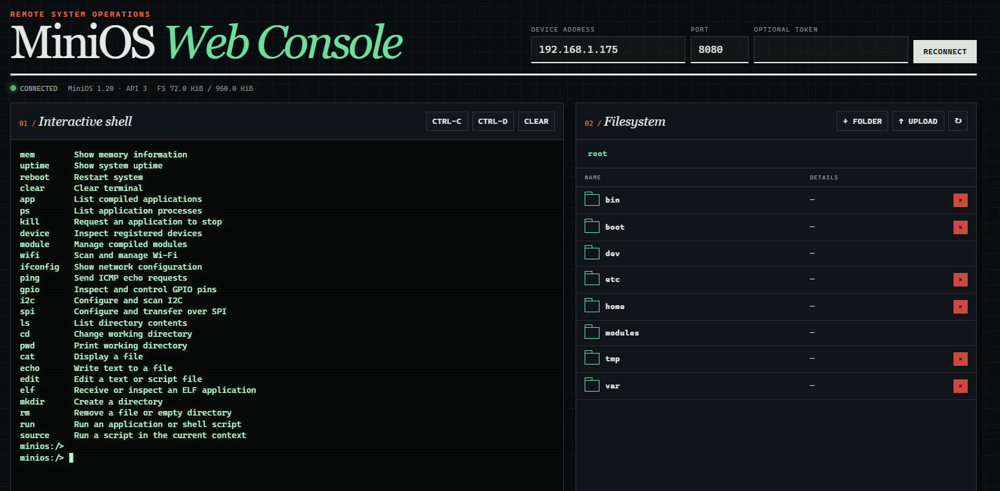

# MiniOS 1.20

> Português | [English](#english)

MiniOS é um pequeno sistema operativo/runtime modular para microcontroladores
ESP32. Esta página é o guia de utilização do sistema. Para compilar, configurar
ou estender o firmware, consulte o [guia de build e desenvolvimento](BUILD.md).

## Funcionalidades

- shell interativa através de UART/USB, TCP ou WebSocket;
- edição de linha e editor de texto com sequências ANSI/VT100;
- configuração persistente em NVS;
- filesystem LittleFS com diretórios e ficheiros;
- GPIO, I²C e SPI;
- Wi-Fi station, IPv4, DNS e ping;
- Device Manager e namespaces virtuais `/dev` e `/modules`;
- módulos internos, com um driver OLED SSD1315 128×64 de exemplo;
- aplicações internas, com exemplos de processos e terminação cooperativa;
- aplicações ELF32 RISC-V externas;
- shell scripting e execução automática de `/boot/startup.rc`;
- WebShell externo com terminal e explorador de ficheiros.

## Aceder ao MiniOS

### Consola local

Depois de gravar o firmware, abra o monitor série:

```bash
idf.py -p PORT monitor
```

O prompt apresenta o diretório atual:

```text
minios:/>
```

### Shell TCP

Use `ifconfig` para obter o IP e ligue à porta 2323 com `nc`, `ncat` ou um
cliente Telnet:

```bash
nc 192.168.1.50 2323
```

A shell TCP aceita um cliente de cada vez, suporta negociação Telnet e expõe
os mesmos comandos da consola local. Não possui autenticação nem encriptação;
utilize-a apenas numa rede de confiança.

### WebShell

Abra [tools/webshell/minios-webshell.html](tools/webshell/minios-webshell.html),
indique o endereço do dispositivo, porta `8080` e o token, caso tenha sido
configurado. Se o browser bloquear pedidos iniciados por `file://`, execute:

```powershell
.\tools\webshell\serve-webshell.ps1
```

A WebShell inclui terminal ANSI e explorador LittleFS com navegação, upload,
download, criação de pastas e remoção. `+ FILE` cria um ficheiro de texto;
clique no nome ou no botão de edição para abrir um ficheiro UTF-8 existente.
`Ctrl-S` guarda, `Esc` fecha e Tab insere quatro espaços. O tamanho aceite
depende de `MINIOS_WEB_MAX_UPLOAD_SIZE`, com um limite máximo de 64 KiB no
editor. `/dev` lista os dispositivos e
`/modules` lista os módulos e respetivo estado; ambos são read-only. Apenas uma
sessão WebSocket pode estar ativa. HTTP/WS não é encriptado e deve permanecer
numa rede de confiança.



## Referência de comandos

Os comandos efetivamente disponíveis dependem das opções usadas ao compilar o
firmware. `help` mostra o registry da imagem em execução.

| Comando | Sintaxe | Utilização |
| --- | --- | --- |
| `help` | `help` | Lista comandos disponíveis |
| `version` | `version` | Mostra versões do MiniOS e da API |
| `info` | `info` | Mostra sistema e target |
| `mem` | `mem` | Mostra estatísticas da heap |
| `uptime` | `uptime` | Mostra o tempo desde o arranque |
| `reboot` | `reboot` | Reinicia o dispositivo |
| `clear` | `clear` | Limpa um terminal ANSI |
| `config` | `config <get\|set\|list\|delete> ...` | Gere configuração em NVS |
| `ls` | `ls [path]` | Lista um diretório |
| `cd` | `cd <path>` | Muda o diretório atual |
| `pwd` | `pwd` | Mostra o diretório atual |
| `cat` | `cat <file>` | Mostra um ficheiro |
| `echo` | `echo <text> [>\|>>] <file>` | Substitui ou acrescenta texto |
| `edit` | `edit <file>` | Edita texto interativamente |
| `mkdir` | `mkdir <path>` | Cria um diretório |
| `rm` | `rm <path>` | Remove ficheiro ou pasta vazia |
| `device` | `device <list\|info\|write\|control> ...` | Gere dispositivos |
| `module` | `module <list\|info\|load\|unload> ...` | Gere módulos internos |
| `gpio` | `gpio <list\|info\|mode\|read\|write\|reset> ...` | Controla GPIO |
| `i2c` | `i2c <init\|status\|scan> ...` | Configura e pesquisa I²C |
| `spi` | `spi <init\|status\|transfer> ...` | Configura e utiliza SPI |
| `wifi` | `wifi <scan\|connect\|disconnect\|status> ...` | Gere Wi-Fi |
| `ifconfig` | `ifconfig` | Mostra IPv4 de `wifi0` |
| `ping` | `ping <host> [count]` | Envia pedidos ICMP echo |
| `app` | `app <list\|info> ...` | Lista aplicações internas |
| `run` | `run <app> [args...]` ou `run <file>` | Executa aplicação ou script |
| `ps` | `ps` | Lista processos |
| `kill` | `kill <pid>` | Solicita a paragem de um processo |
| `elf` | `elf <info path\|receive name>` | Recebe ou inspeciona ELF |
| `source` | `source <file>` | Executa script no contexto atual |

O prompt reconhece `←`, `→`, `Home`, `End` e `Delete`. A linha aceita até 127
caracteres e 36 argumentos. Pipes, wildcards e redirecionamento genérico ainda
não são suportados; `>` e `>>` são tratados especificamente por `echo`.

## Configuração persistente

```text
config set wifi.ssid MyNetwork
config set wifi.password password
config set wifi.autoconnect true
config get wifi.ssid
config list
config delete wifi.ssid
```

As chaves aceitam letras, números, `.`, `_` e `-`, até 63 caracteres. Valores
têm no máximo 127 caracteres e não podem conter espaços. `config get` e
`config list` ocultam a password Wi-Fi.

## Ficheiros e editor

No primeiro arranque são criados `/bin`, `/boot`, `/dev`, `/etc`, `/home`,
`/modules`, `/tmp` e `/var`.

```text
mkdir /home/demo
cd /home/demo
echo hello > note.txt
echo second line >> note.txt
cat note.txt
ls
pwd
rm note.txt
```

`/dev` e `/modules` são namespaces reservados e não podem ser alterados pelos
comandos de ficheiros nem pela WebShell. `ls /dev` mostra dispositivos e
`ls /modules` mostra módulos conhecidos.

Para editar um ficheiro:

```text
edit /boot/startup.rc
```

Use setas, `Home`, `End`, `Delete`, Backspace e Enter. `Ctrl-S` guarda e
`Ctrl-Q` sai; pressione `Ctrl-Q` novamente para descartar alterações. O editor
aceita texto ASCII até 64 linhas e 72 caracteres por linha.

## Hardware e dispositivos

### GPIO

```text
gpio list
gpio info 8
gpio mode 8 out
gpio write 8 1
gpio mode 3 pullup
gpio read 3
gpio reset 8
```

`gpio list` apresenta as capacidades reais do target. Pinos reservados por um
driver ou bus não podem ser reconfigurados.

### I²C

Os pinos dependem da placa; GPIO 8/9 são apenas um exemplo:

```text
i2c status
i2c init 8 9
i2c scan
```

O bus funciona a 100 kHz e necessita de pull-ups externos adequados.

### SPI

O SPI exige pinos explícitos. Neste exemplo são usados MOSI 6, MISO 5, SCLK 4
e CS 7 a 4 MHz:

```text
spi status
spi init 6 5 4 7 4000000
spi transfer 9f 00 00 00
```

### Device Manager

```text
device list
device info uart0
device info /dev/gpio
device write display0 Hello MiniOS
device control display0 clear
ls /dev
```

Os dispositivos padrão são `uart0`, `gpio`, `i2c0`, `spi0` e, quando a rede
está incluída, `wifi0`.

## Exemplo de módulo: OLED SSD1315

O `ssd1315` é um módulo de exemplo incluído para demonstrar como um driver
interno regista e controla um dispositivo. Não é um componente obrigatório do
MiniOS e pode ser excluído no `menuconfig`. Inicialize I²C antes de o carregar:

```text
i2c init 8 9
i2c scan
module list
module load ssd1315
device info display0
device write display0 Hello MiniOS
device control display0 newline
device write display0 Second line
device write display0 --at 12 24 Text at x12 y24
device control display0 contrast 160
device control display0 invert
device control display0 normal
device control display0 clear
module unload ssd1315
```

O endereço por omissão é `0x3c`; use, por exemplo,
`module load ssd1315 0x3d` para o substituir. O dispositivo `/dev/display0`
suporta `clear`, `refresh`, `newline`, `position`, `contrast`, `on`, `off`,
`invert` e `normal`. `position <x> <y>` usa píxeis, com `x=0..122` e
`y=0..57` para caracteres 5×7 totalmente visíveis. Enquanto o módulo estiver
carregado, o bus I²C não pode ser reconfigurado.

## Rede

Ligação temporária:

```text
wifi scan
wifi connect MyNetwork password
wifi status
ifconfig
ping 1.1.1.1
ping example.com 3
wifi disconnect
```

Ligação automática guardada em NVS:

```text
config set wifi.ssid MyNetwork
config set wifi.password password
config set wifi.autoconnect true
wifi connect
```

`wifi.autoconnect` aceita `1`, `true` ou `yes`. Falhas Wi-Fi não interrompem a
shell. O scan mostra até 20 redes e `ping` aceita entre 1 e 10 pedidos.

## Exemplos de aplicações e processos

As aplicações seguintes são exemplos independentes e selecionáveis no build;
não fazem parte dos serviços obrigatórios do MiniOS:

- `hello`: mostra uma saudação e os argumentos;
- `counter`: contador cooperativo para testar processos;
- `welcome`: mostra uma saudação e o IP em `/dev/display0`.

```text
app list
app info counter
run hello MiniOS
run counter 30 1000
ps
kill 2
ps
```

Existem quatro workers e no máximo quatro processos simultâneos. Cada processo
aceita oito argumentos de até 31 caracteres. `kill` é cooperativo; a aplicação
termina quando verifica o pedido de paragem. Para usar `welcome`:

```text
i2c init 8 9
module load ssd1315
wifi connect
run welcome
```

## Aplicações ELF externas

Para receber um ELF pela shell, converta-o para hexadecimal no PC:

```powershell
[Convert]::ToHexString([IO.File]::ReadAllBytes(".\hello_elf.elf")) |
    Set-Clipboard
```

Depois:

```text
elf receive hello_elf
<colar hexadecimal>
Ctrl-D
elf info /bin/hello_elf.elf
run /bin/hello_elf.elf first second
ps
```

O nome aceita 15 caracteres e ficheiro/imagem têm limite de 32 KiB. ELF
executa código nativo sem sandbox: instale apenas binários de confiança. As
instruções para compilar uma aplicação estão no [guia de build](BUILD.md#compilar-uma-aplicação-elf-externa).

## Shell scripting

`run <file>` cria um contexto de variáveis; `source <file>` reutiliza o
contexto atual. Durante o arranque, o MiniOS tenta executar
`/boot/startup.rc`.

```text
# /boot/startup.rc
set attempts 3
repeat $attempts
    wifi connect
    if $? == 0
        exit 0
    else
        sleep 1000
    endif
endrepeat
exit 1
```

A linguagem suporta comentários `#`, `set`, `$name`, `${name}`, `$?`,
`sleep`, `if`/`else`/`endif`, `repeat`/`endrepeat` e `exit`. Condições aceitam
um valor simples, `==` ou `!=`. Os limites são 4095 bytes, 96 linhas, oito
variáveis, três scripts ativos, oito blocos aninhados, 100 repetições por bloco
e 1000 instruções por contexto.

## Segurança e limites

- TCP, HTTP e WebSocket não fornecem encriptação;
- a WebShell pode exigir um token, mas deve permanecer numa rede de confiança;
- ELF executa código nativo sem isolamento;
- `/dev` e `/modules` são protegidos contra escrita;
- buffers, registries, workers e stacks têm limites explícitos.

## Documentação técnica

- [Build, menuconfig e desenvolvimento](BUILD.md)
- [Licença Apache 2.0](LICENSE)

Copyright © 2026 [joaquim.org](https://www.joaquim.org).

## English

MiniOS is a small modular operating system/runtime for ESP32 microcontrollers.
This page is the OS user guide. For firmware building, configuration, and
extension, see the [build and development guide](BUILD.md#english).

### Features

- interactive UART/USB, TCP, and WebSocket shells;
- ANSI line editing and text editor;
- persistent NVS configuration and LittleFS filesystem;
- GPIO, I²C, SPI, Wi-Fi, IPv4, DNS, and ping;
- Device Manager with `/dev` and `/modules` namespaces;
- built-in modules, with an example SSD1315 128×64 OLED driver;
- built-in applications, with process and cooperative-termination examples;
- external RISC-V ELF32 applications;
- shell scripts and automatic `/boot/startup.rc`;
- external WebShell with terminal and file explorer.

### Accessing MiniOS

Use `idf.py -p PORT monitor` for the local console. For TCP, obtain the address
with `ifconfig` and connect to port 2323:

```bash
nc 192.168.1.50 2323
```

For Web access, open
[tools/webshell/minios-webshell.html](tools/webshell/minios-webshell.html), enter
the device address, port 8080, and optional token. If `file://` requests are
blocked, run `.\tools\webshell\serve-webshell.ps1`. The explorer shows devices
under read-only `/dev` and modules with their status under read-only
`/modules`. TCP and HTTP/WS are not encrypted and must only be used on trusted
networks.

Use `+ FILE` to create a text file, or select a file name/edit button to open
existing UTF-8 text. `Ctrl-S` saves, `Esc` closes, and Tab inserts four spaces.
The configured `MINIOS_WEB_MAX_UPLOAD_SIZE` applies, with a 64 KiB editor
maximum. Creating and editing remain disabled in `/dev` and `/modules`.


### Command reference

The exact command set depends on build options. `help` lists the registry in
the running image.

| Command | Syntax | Purpose |
| --- | --- | --- |
| `help` | `help` | List commands |
| `version` | `version` | Show MiniOS/API versions |
| `info` | `info` | Show system and target information |
| `mem` | `mem` | Show heap statistics |
| `uptime` | `uptime` | Show uptime |
| `reboot` | `reboot` | Restart the device |
| `clear` | `clear` | Clear an ANSI terminal |
| `config` | `config <get\|set\|list\|delete> ...` | Manage NVS configuration |
| `ls` | `ls [path]` | List a directory |
| `cd` | `cd <path>` | Change directory |
| `pwd` | `pwd` | Print current directory |
| `cat` | `cat <file>` | Display a file |
| `echo` | `echo <text> [>\|>>] <file>` | Replace or append text |
| `edit` | `edit <file>` | Edit text interactively |
| `mkdir` | `mkdir <path>` | Create a directory |
| `rm` | `rm <path>` | Remove a file or empty directory |
| `device` | `device <list\|info\|write\|control> ...` | Manage devices |
| `module` | `module <list\|info\|load\|unload> ...` | Manage built-in modules |
| `gpio` | `gpio <list\|info\|mode\|read\|write\|reset> ...` | Control GPIO |
| `i2c` | `i2c <init\|status\|scan> ...` | Configure/scan I²C |
| `spi` | `spi <init\|status\|transfer> ...` | Configure/use SPI |
| `wifi` | `wifi <scan\|connect\|disconnect\|status> ...` | Manage Wi-Fi |
| `ifconfig` | `ifconfig` | Show `wifi0` IPv4 configuration |
| `ping` | `ping <host> [count]` | Send ICMP echo requests |
| `app` | `app <list\|info> ...` | Inspect built-in applications |
| `run` | `run <app> [args...]` or `run <file>` | Run app or script |
| `ps` | `ps` | List processes |
| `kill` | `kill <pid>` | Request cooperative termination |
| `elf` | `elf <info path\|receive name>` | Receive or inspect ELF |
| `source` | `source <file>` | Run script in current context |

The prompt supports arrows, `Home`, `End`, and `Delete`. Lines are limited to
127 characters and 36 arguments. Generic pipes, wildcards, and redirection are
not supported.

### Configuration and files

```text
config set wifi.ssid MyNetwork
config set wifi.password password
config set wifi.autoconnect true
config list

mkdir /home/demo
cd /home/demo
echo hello > note.txt
echo second line >> note.txt
cat note.txt
ls
```

Keys are limited to 63 characters and values to 127 characters without spaces.
Wi-Fi passwords are redacted. `/dev` and `/modules` are protected namespaces.

Use `edit <file>` for the ANSI editor. `Ctrl-S` saves and `Ctrl-Q` exits; press
`Ctrl-Q` again to discard changes. Files are limited to 64 ASCII lines of 72
characters.

### Hardware and devices

```text
gpio list
gpio mode 8 out
gpio write 8 1

i2c init 8 9
i2c scan

spi init 6 5 4 7 4000000
spi transfer 9f 00 00 00

device list
device info uart0
```

Pins are board-specific. The HAL rejects unsupported output pins and pins
reserved by an initialized bus or driver.

### Example module: SSD1315 OLED

`ssd1315` is an included example showing how a built-in driver registers and
controls a device. It is not a required MiniOS component and can be excluded
through `menuconfig`.

```text
i2c init 8 9
module load ssd1315
device write display0 Hello MiniOS
device control display0 newline
device write display0 Second line
device write display0 --at 12 24 Positioned text
device control display0 contrast 160
device control display0 clear
module unload ssd1315
```

The default address is `0x3c`; override it with
`module load ssd1315 0x3d`. `/dev/display0` supports `clear`, `refresh`,
`newline`, `position`, `contrast`, `on`, `off`, `invert`, and `normal`.

### Networking

```text
wifi scan
wifi connect MyNetwork password
wifi status
ifconfig
ping example.com 3
wifi disconnect
```

For boot-time connection, save `wifi.ssid`, `wifi.password`, and set
`wifi.autoconnect` to `true`. Wi-Fi failures do not stop the shell.

### Example applications and processes

`hello`, `counter`, and `welcome` are independent, selectable examples rather
than required MiniOS services:

```text
app list
app info counter
run hello MiniOS
run counter 30 1000
ps
kill 2
```

The runtime supports four simultaneous processes. Termination is cooperative.
`welcome` writes a greeting and network IP to a loaded `/dev/display0`.

### External ELF applications

Convert a trusted ELF to hexadecimal, start `elf receive <name>`, paste it,
and finish with `Ctrl-D`:

```text
elf receive hello_elf
<paste hexadecimal>
Ctrl-D
elf info /bin/hello_elf.elf
run /bin/hello_elf.elf first second
```

Names are limited to 15 characters and files/images to 32 KiB. ELF runs native
code without a sandbox. Build instructions are in the
[development guide](BUILD.md#building-an-external-elf-application).

### Shell scripting

`run <file>` creates a variable context; `source <file>` reuses the current
one. MiniOS executes `/boot/startup.rc` during boot when present.

```text
set attempts 3
repeat $attempts
    wifi connect
    if $? == 0
        exit 0
    else
        sleep 1000
    endif
endrepeat
```

The language supports comments, variables, `$?`, `sleep`, conditionals,
bounded loops, and `exit`. Scripts are limited to 4095 bytes and 96 lines.

### Technical documentation

- [Build, menuconfig, and development](BUILD.md#english)
- [Apache License 2.0](LICENSE)

Copyright © 2026 [joaquim.org](https://www.joaquim.org).
